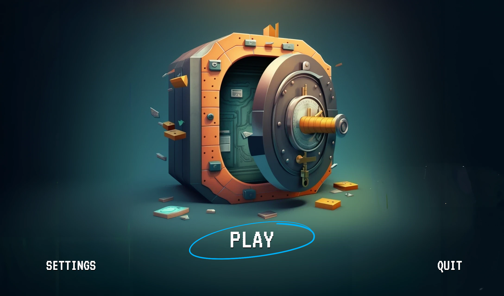
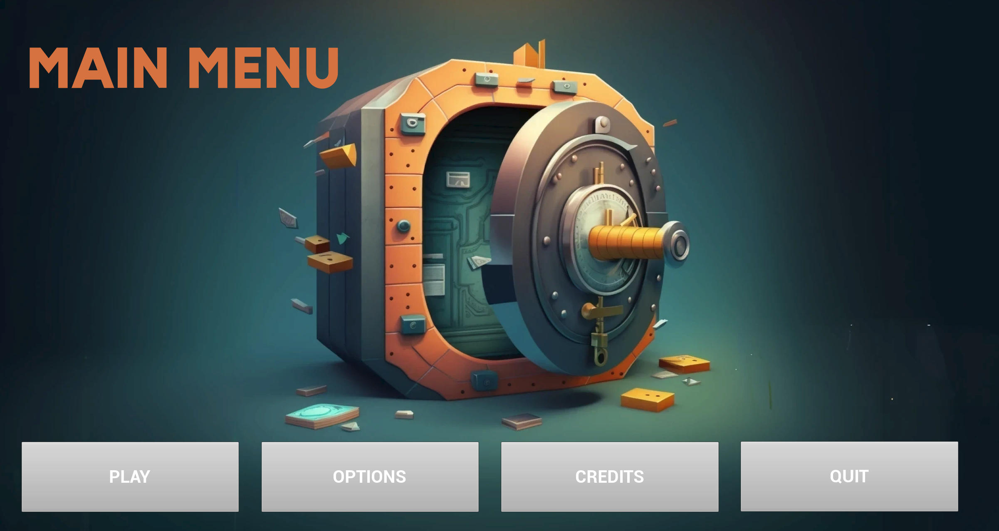
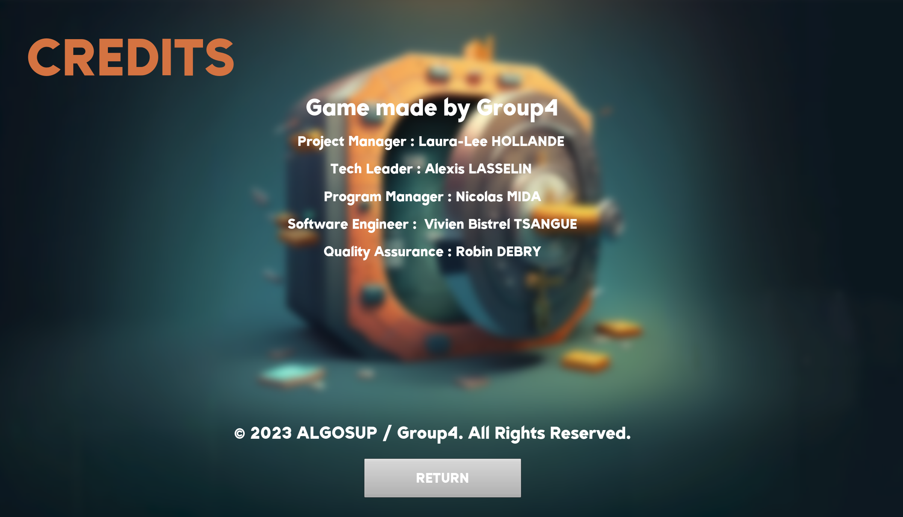
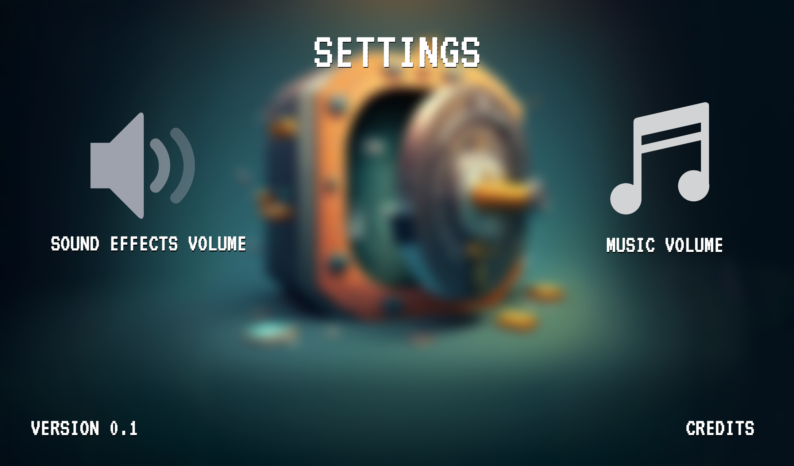
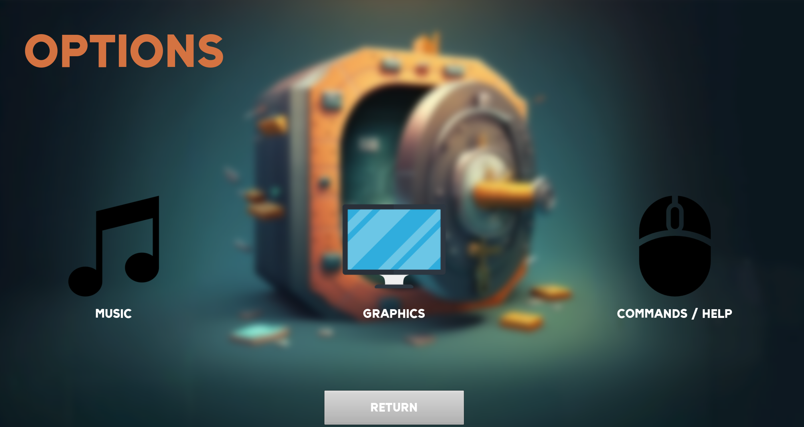
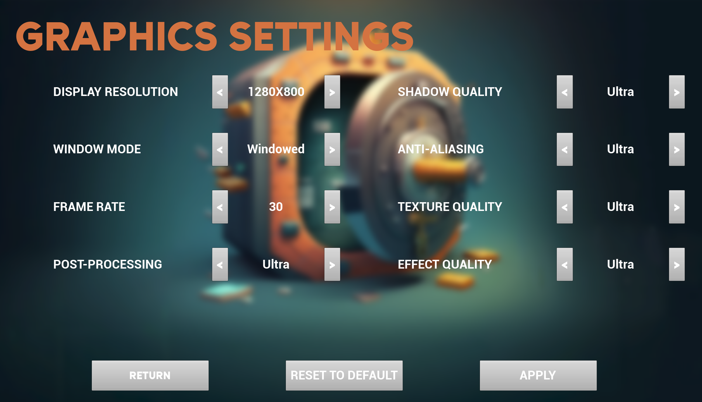
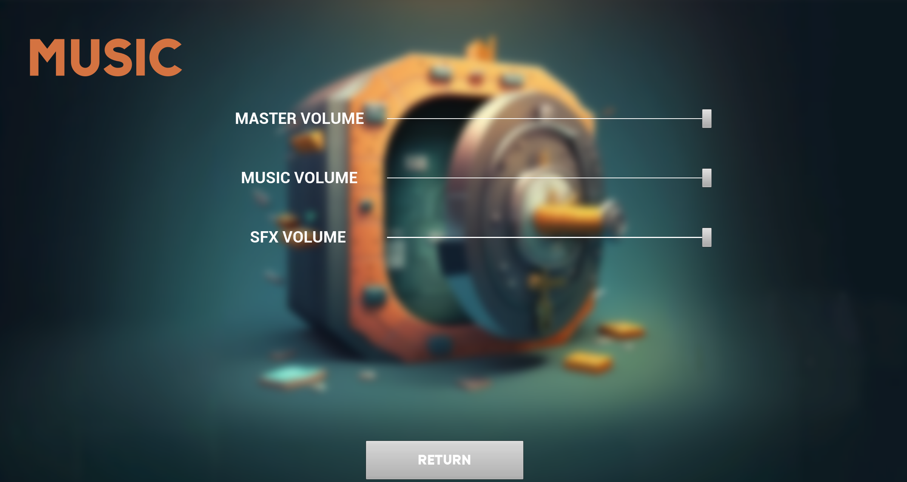

# 2022-2023 Project4 - Game Design - Group 4

___

<details>
<summary>Table of Contents</summary>

- [2022-2023 Project4 - Game Design - Group 4](#2022-2023-project4---game-design---group-4)
- [Project Team](#project-team)
- [Stakeholders](#stakeholders)
- [1. Project Introduction](#1-project-introduction)
  - [A. Purpose of the document](#a-purpose-of-the-document)
  - [B. Purpose of the project](#b-purpose-of-the-project)
  - [C. Goal of the project](#c-goal-of-the-project)
- [2. Game Introduction](#2-game-introduction)
  - [A. Purpose](#a-purpose)
  - [B. Scope](#b-scope)
    - [B.1. In scope](#b1-in-scope)
    - [B.2. Out of scope](#b2-out-of-scope)
  - [C. Game Overview](#c-game-overview)
- [3. Gameplay](#3-gameplay)
  - [A. Game Mechanics](#a-game-mechanics)
    - [A.1. Core Gameplay Mechanics](#a1-core-gameplay-mechanics)
  - [B. Objective](#b-objective)
  - [C. Controls](#c-controls)
  - [D. The Turrets](#d-the-turrets)
  - [E. The Opponents](#e-the-opponents)
  - [F. Wave System](#f-wave-system)
  - [G. Player Progression (Prestige System)](#g-player-progression-prestige-system)
- [4. Story and Narrative](#4-story-and-narrative)
  - [A. Background story](#a-background-story)
  - [B. Characters](#b-characters)
  - [C. Dialogue and narrative](#c-dialogue-and-narrative)
  - [D. Plot and story progression](#d-plot-and-story-progression)
  - [E. Ending](#e-ending)
- [5. User Interface](#5-user-interface)
  - [A. Main menu](#a-main-menu)
    - [A.1. Main menu mock-up](#a1-main-menu-mock-up)
    - [A.2. Final main menu](#a2-final-main-menu)
  - [B. In-game interface](#b-in-game-interface)
  - [C. Heads-up display (HUD)](#c-heads-up-display-hud)
  - [D. Settings and options](#d-settings-and-options)
    - [D.1. Mock-up](#d1-mock-up)
    - [D.2 Final settings menu](#d2-final-settings-menu)
    - [D.3. Graphics Settings](#d3-graphics-settings)
    - [D.4. Audio Settings](#d4-audio-settings)
    - [D.5. Commands Settings](#d5-commands-settings)
  - [E. Tutorial and Help](#e-tutorial-and-help)
- [6. Audio and Visuals](#6-audio-and-visuals)
  - [A. Graphics](#a-graphics)
  - [B. Art Style](#b-art-style)
  - [C. Animation](#c-animation)
  - [D. Sound effects](#d-sound-effects)
  - [E. Music](#e-music)
- [7. Personas](#7-personas)
  - [A. The Gamer : Ethan](#a-the-gamer--ethan)
  - [B. The Worker : John](#b-the-worker--john)
  - [C. The Passionate : Chris](#c-the-passionate--chris)
  - [D. The Involved : Marie](#d-the-involved--marie)
- [8. Legal Considerations](#8-legal-considerations)
  - [A. Copyright](#a-copyright)
  - [B. Intellectual property](#b-intellectual-property)
  - [C. Liability and warranties](#c-liability-and-warranties)
- [9. Timeline and Budget](#9-timeline-and-budget)
  - [A. Project milestones](#a-project-milestones)
  - [B. Development schedule](#b-development-schedule)
  - [C. Budget and Resources](#c-budget-and-resources)
  - [C.1 Budget](#c1-budget)
  - [C.2 Resources](#c2-resources)
- [10. Glossary](#10-glossary)
</details>

___


# Project Team

| Name                   | Role              |
| ---------------------- | ----------------- |
| Laura-Lee HOLLANDE     | Project Manager   |
| Nicolas MIDA           | Program Manager   |
| Alexis LASSELIN        | Tech Lead         |
| Vivien Bistrel TSANGUE | Software Engineer |
| Robin DEBRY            | QA                |

# Stakeholders

- ALGOSUP 
- Users

# 1. Project Introduction

## A. Purpose of the document

This document is the functional specification of the game. It describes the game's features and the rules that govern them. It is intended for the development team, the testers and the players.

## B. Purpose of the project 

The purpose of this project is to create a fully working game using Unreal Engine 4.27.  We are completely free to choose the theme of the game, the game mechanics and the game's universe.

Our group has chosen to create a Tower Defense game based on a bank universe

## C. Goal of the project

The goal of the project is to design, code, and produce a full game using Unreal Engine 4. It will, of course, be a small but polished game. Design, UI/UX, and testing are crucial. 

The final game will have to feature some sort of gameplay innovation, and be as bug-free as possible, as well as a polished, fun, thoroughly tested and iterated upon project. 


# 2. Game Introduction

## A. Purpose 

The purpose of the game is to defend a bank from waves of criminals. The player will have to build and upgrade turrets to stop the criminals from stealing the bank's money (hit points).

## B. Scope

### B.1. In scope

- The game will be a Tower Defense / Idle game
- Single-player
- PC only
- English only


### B.2. Out of scope

- Multiplayer
- Porting to other platforms
- Online features
- Other languages
- Other game modes

## C. Game Overview

The game takes place in a bank universe. 

The player takes on the role of a bank manager who must defend the bank against several types of criminals who arrive in successive waves every 10 seconds.

To defend the bank, the player must build and upgrade different types of turrets, each with unique abilities and strengths, to stop the criminals from stealing the bank's money (represented by hit points). The player must also manage their resources wisely, including the amount of money spent on building and upgrading turrets, to ensure they can withstand the increasing difficulty of each wave.

Additionally, the game includes an idle aspect, allowing players to earn money even when they are not actively playing the game. This allows players to progress and upgrade their turrets even when they are away from the game, encouraging longer play sessions and a sense of continuous progress.

# 3. Gameplay 

## A. Game Mechanics 

### A.1. Core Gameplay Mechanics

- <b>Building Turrets</b> : Players can build and upgrade different types of turrets to defend the bank from waves of criminals. Each turret type has its own strengths and weaknesses, and costs a different amount of in-game currency to build and upgrade.
  
- <b>Criminal Waves</b> : Criminals arrive in successive waves every 10 seconds, with each wave becoming progressively harder to defeat. The player must use their turrets strategically to defend the bank and prevent the criminals from stealing the bank's money.
  
- <b>In-Game Currency</b> : The player earns in-game currency by defeating criminals, which they can use to build and upgrade turrets. The amount of currency earned per defeated criminal depends on the type of criminal and the wave they appear in.
  
- <b>Bank Hit Points</b> : The bank has a set amount money (Hit Points) at the beginning of the game, and every time a criminal successfully steals money, the bank loses hit points. If the bank's hit points reach zero, the game is over.

## B. Objective


## C. Controls

As the map will fill the whole size of the screen, the game will mainly be played with the mouse. 

Keyboard shortcuts will be implemented to access the different categories of settings

Here the list of the different shortcuts :

| Key | Action | Description | 
| --- | ------ | ----------- |
| `ESC` | Pause & Settings | Pause the game and access the settings menu |
| `Left Click` | Select | The main action of the game. Click on a pre-location to place a turret, click on a turret to upgrade it. |

## D. The Turrets 

Currently there are 3 types of turrets :

- The **Gunner**, which shoots at the closest criminal in range and has a high rate of fire (1 bullet per second) and do 20 damage per bullet. It cost 60 golds to build.

- The **Missile Launcher**, which shoots gold bars in a bell-shaped pattern and can hit multiple criminals at once by a 2x2 area. It has a medium rate of fire (1 bullet every 2 seconds) and do 25 damage per bullet. It cost 120 golds to build.

- The **Bitcoin Launcher**, is a slow turret doing 15 damage per bullet. It has a medium-high rate of fire (1 bullet every 1.5 seconds). If a criminal is hit by a bullet, it will be slowed down by 20 % for 2-3 seconds. It cost 180 golds to build.

For the moment the turrets got three levels of upgrade 

## E. The Opponents

Several types of criminals will attack the bank. Each type of criminal has its own strengths and weaknesses, and will appear in different waves.

They are inspired by Team Fortress 2 characters.

| Criminal | Description | Hit Points | Speed | Damage | Reward (gold) |
| -------- | ----------- | ---------- | ----- | ------ | ------ |
| **Thief** | A small criminal who can steal money from the bank. He is the weakest criminal and the first to appear. | 300 | Medium | Low | 10 golds |
| **Slayer** | A medium-sized criminal with less health than the thief but more damage. | 100 | High | High | 5 golds |
| **Warrior** | A large criminal that could be compared to a tank. He has a lot of health but is slow. However he can do a lot of damage. | 500 | Low | High | 20 golds |

## F. Wave System

Every 10 seconds, a new wave of criminals will arrive. As more waves are completed, the difficulty will increase : 

  - More criminals will arrive
  - The criminals will be stronger, faster and more resistant

If the player fails to stop the criminals, he will return to the previous wave. A button will allows the player to choose whether to stay on this wave or to keep going. 

## G. Player Progression (Prestige System)

At a certain point, the player will encounter difficulties in defending the bank. To overcome this, the player will have the choice to reset the game and restart from scratch by doing a "Prestige".


# 4. Story and Narrative

## A. Background story

> <cite>Vaultburg, 2048 <cite>
> 
>Following the financial shock of 2047, many people have started attacking banks in order to steal the few resources still stored to survive. However, the banks don't take this lying down and decide to arm themselves. They also call on you, a ship owner, to improve their defense. Use your knowledge to transform a bank into a fortress designed to withstand all external assaults!

## B. Characters

There's three main characters in the game :

The **Banker** (aka **Mr. Wertheimer**), who's the owner of the bank and the one who called you to help him defend the bank.

**Giovanni Machiavelli**, the main villain of the game. He is the leader of the criminal organization and is responsible for the attacks on the bank.

**You**, the protagonist of the game have been called by the Banker to help him defend the bank against the criminals.

## C. Dialogue and narrative

```
Banker: 
    Hey, are you the guy we're waiting for? Not a moment too soon, time is money! So listen, we've already beaten back a wave of scouts but it's getting tense...

*phone*

Banker:
    Hello?

?:
    Hello Mr. Wertheimer, my name is Giovanni Machiavelli and I wanted to tell you that your actions towards members of my clan have disappointed me. I would like to inform you that we are going to receive some compensation, we will be there in 5 minutes, see you soon!

Banker:
    This doesn't look good, quickly, you have to help us, get ready for the bank's defense!

**Launch of the tutorial**
```
## D. Plot and story progression

We did not plan to develop our story during the game, we only wanted to give a background story to the game.

## E. Ending

As the waves are infinite, the game will never end. The player will have to play as long as he wants to get the highest wave possible.

# 5. User Interface

## A. Main menu

### A.1. Main menu mock-up

<sub><b>Note :</b> This mock-up is not final and is subject to change.</sub

### A.2. Final main menu



The main menu will be composed of four main parts :

- The **Play button** will allow the player to start the game

- The **Options button** were the player can change the game's settings

- The **Credits button** will allow the player to see the credits



- The **Quit button** will allow the player to quit the game
## B. In-game interface

Here is a simple mock-up of what the game's interface will look like :


<sub><b>Note :</b> This mock-up is not final and is subject to change.</sub>

The purple box represent the spawn point of the criminals and the grey one the bank vault.
## C. Heads-up display (HUD)

As we saw in the mock-up, the HUD will be composed of three main parts :

- The top section will display the current wave, the amount of money the player has, the prestige button and the settings button.


- The bottom section will display the different categories of turrets and the different upgrades available for each turret when the player will click either on the arrow or on the pre-location.

## D. Settings and options

### D.1. Mock-up

<sub><b>Note :</b> This mock-up is not final and is subject to change.</sub>

### D.2 Final settings menu



In the options menu, the player will be able to change the game's settings :
- The audio 
- The graphics 
- The commands 


### D.3. Graphics Settings

<!-- Insert here a screenshot of the graphics menu -->


Inside the graphics settings, the player will access the following options : 
    - **The display resolution** (severals are available depending on the player's screen)
    - **The window mode** (full-screen, windowed-full-screen or windowed)
    - **The frame rate** (30, 60, 144 and unlimited)
    - **The Post-Processing** (From Low to Ultra)
    - **Shadows Quality** (From Low to Ultra)
    - **Anti-Aliasing** (From Low to Ultra)
    - **Texture Quality** (From Low to Ultra)
    - **Effects Quality** (From Low to Ultra)

For more explanations on what each graphic settings does, please refer to the [Glossary](#glossary).

### D.4. Audio Settings

<!-- Insert here a screenshot of the music menu -->


Inside the audio settings, the player will access the following options : 
    - **The music volume** (From 0 to 100)
    - **The sound effects volume** (From 0 to 100)
    - **The voice volume** (From 0 to 100)

They are all represented by a slider that the player can move to change the volume. More visible details will be added to the sliders to make it easier to use.

### D.5. Commands Settings

<!-- Insert here a screenshot of the commands menu -->


In the commands settings, the player will be able to take note of the different commands available in the game.


## E. Tutorial and Help

A tutorial will be implemented to explain the game's universe and the game's mechanics. It will guide the player through the first wave however the player will be able to skip it if he wants to.

In the settings menu, the player will be able to access the tutorial at any time with also some tips and tricks.

# 6. Audio and Visuals
## A. Graphics

The game will feature 3D graphics with a cartoonish art style inspired by "Team Fortress 2" with a 2D isometric view.

The game will support a range of different resolutions and display modes, including full-screen and windowed modes. The graphics settings will allow players to adjust the quality of textures, shadows, and other visual effects to optimize performance on their system.
## B. Art Style

For the art style, we will use a cartoon style inspired by the multiplayer FPS game "Team Fortress 2".
## C. Animation

The game will feature smooth and fluid animations for all characters and objects in the game world. The player's turrets will rotate and track enemies as they move, and will fire projectiles with realistic physics and impact effects.

For the enemy characters, they will move with a range of different animations, depending on their type. 

The game will also feature a range of different visual effects, such as explosions, smoke, and particle effects, to enhance the overall look and feel of the game.
## D. Sound effects

The game will feature a range of different sound effects to enhance the player's immersion in the game world. These sound effects will include:

- Gunfire and explosions for the player's turrets and enemy attacks
- Sound effects for the player's interactions with the game world, such as placing turrets and upgrading them
- Ambient sound effects to create a sense of atmosphere and immersion

The sound effects will be designed to be realistic and immersive, without being overly loud or distracting. The player will have the option to adjust the volume of the sound effects in the game's settings menu.


There's will be no voice acting in the game as it will takes too much time to implement.

## E. Music

Same as the sound effects, a music will be implemented in the game 

We plan to use at least two different musics in the game, one for the main menu and one for the game itself. It will enhance the player's immersion in the game world without being too distracting or loud.However it could be muted by the player in the settings menu.
# 7. Personas

## A. The Gamer : Ethan

<div align="center">
  
</div>

Ethan is a 15-year-old French student who loves playing all kinds of video games. He spends most of his free time playing games on his computer and enjoys games that challenge his problem-solving skills.

He's a tech-savvy individual who is comfortable using a variety of software and hardware. He is also an active member of online gaming communities and enjoys discussing games with other players.

He's looking for a game that offers a challenging and engaging gameplay experience, with a variety of different levels and enemies to defeat. He is also interested in games with a strong visual style and immersive audio.

As a student, Ethan has limited funds to spend on games, so he is always on the lookout for games that offer good value for money. He is also interested in games that offer replayability and the ability to customize gameplay experiences.


## B. The Worker : John

<div align="center">
  
</div>

John is a 33 years old worker who works as a game designer in a video game company for 7 years. He likes to play some games in his free time and he is looking for a new game to play. His friend, Mike, a coworker, told him about our game.

## C. The Passionate : Chris

<div align="center">
  
</div>

Chris is a 24 year old game developer with a passion for video games, particularly tower defense games. He's in relationship with Marie, a 23 year old nurse. 

He really likes to finish every game he starts, especially collecting all the achievements. While he was on Github, he saw our game's repository and is really interested in it.

## D. The Involved : Marie

<div align="center">
  
</div>

Marie is a 23 year old nurse who works in a hospital. She is in a relationship with Chris, a 24 year old game developer. She doesn't play video games at all, but she likes to watch Chris playing them. 

During a conversation with Chris, he told her about the game and she told him that she would like to try it.

<sub> All the profile pictures are from [Generated photo](https://generated.photos/faces/)</sub>


# 8. Legal Considerations

## A. Copyright

All assets used in the game, including graphics, music, sound effects, and code, must be either original or properly licensed from their respective owners. The development team will be responsible for ensuring that all assets are properly credited and licensed.

## B. Intellectual property

The game and its underlying code are the intellectual property of the development team. No unauthorized use or distribution of the game will be permitted.

## C. Liability and warranties

The development team will make reasonable efforts to ensure that the game is free from defects and does not violate any laws or regulations. However, the team cannot guarantee that the game will be completely error-free or meet all requirements of every user. 

# 9. Timeline and Budget

## A. Project milestones

| Date       | Deliverable            |
| ---------- | ---------------------- | 
| 2023-03-03 | One sheet document     | 
| 2023-03-10 | Working Prototype      | 
| 2023-03-24 | Demo / Vertical Slice  |
| 2023-04-07 | Final Game, Final Test |

Here's the workshop game pipeline:

Game Idea → Game Concept → One Sheet and Final Game Idea → Pitch → Prototype → Demo and/or Vertical Slice → Testing & Iterating → Final Game
## B. Development schedule

// TODO

## C. Budget and Resources

## C.1 Budget 

For this project, more precisely for the development of the game, there's no budget. We are using free assets and free tools.

## C.2 Resources

Currently, the development team is composed of 5 people. 

- <b>The Project Manager</b>, who is responsible for the project's success and the team's productivity. He is also in charge of the project's budget and the team's schedule.

- <b>The Software Engineer</b>, who is responsible for the game's code and the game's engine. He is also in charge of the game's performance and the game's stability.

- <b>The Tech Lead</b>, who is responsible for the game's architecture and the game's design. He is also in charge of the game's scalability and the game's maintainability.

- <b>The Program Manager</b>, who is responsible for the game's assets and the UI/UX. He is also in charge of the game's visual and the game's audio.

- <b> The Quality Assurance</b>, who is responsible for the game's testing.

These people have more or less knowledge in the game's creation.

The main resources used for the development of the game are people's time, knowledge and skills.
# 10. Glossary

| **Name** | **Abrevation** | **Definition** |
|:--------:|:--------------:|:--------------:|
| Anti-Aliasing | AA | [Anti-Aliasing](https://en.wikipedia.org/wiki/Anti-aliasing) is a method of smoothing out the jagged edges of a 3D object. |
| Area Of Effect | AOE | [Area of Effect](https://en.wikipedia.org/wiki/Glossary_of_video_game_terms#area_of_effect), commonly abbreviated as "AoE", refers to the range of an ability or attack that affects multiple targets within a specific area, rather than a single target. |
| Blueprints | BP | [Blueprints](https://docs.unrealengine.com/en-US/Engine/Blueprints/index.html) are visual scripting tools that allow you to create logic for your game without writing code. |
| C++ | C++ | [C++](https://en.wikipedia.org/wiki/C%2B%2B) is a general-purpose programming language created by Bjarne Stroustrup as an extension of the C programming language, or "C with Classes". |
| Head-Up Display | HUD | [Head-Up Display](https://en.wikipedia.org/wiki/Head-up_display) (HUD) is any transparent display that presents data without requiring users to look away from their usual viewpoints. |
| Idle | Idle | [Idle](https://en.wikipedia.org/wiki/Incremental_game) also known as "inactive" games are video games that require little or no input from the player. The game typically continues to run and progress even when the player is not actively playing, allowing the player to accumulate resources and progress in the game over time.
| Post-processing | PP | [Post-processing](https://docs.unrealengine.com/en-US/Engine/Rendering/PostProcessEffects/index.html) is a technique used in computer graphics to improve the appearance of a rendered image. |
| Steam | Steam | [Steam](https://store.steampowered.com/) is a digital distribution platform developed by Valve Corporation, which offers digital rights management (DRM), multiplayer gaming, video streaming and social networking services. |
| Tower Defense | TD | [Tower Defense](https://en.wikipedia.org/wiki/Tower_defense) is a subgenre of strategy video games in which the player must defend a particular location or path against waves of enemies by strategically placing defensive structures, such as towers or traps, along the path to defeat the enemies before they reach their destination. |
| Unreal Engine | UE | [Unreal Engine](https://www.unrealengine.com/en-US/) is a 3D computer graphics game engine developed by Epic Games. |
| Visual Studio | VS | [Visual Studio](https://visualstudio.microsoft.com/) is an integrated development environment (IDE) from Microsoft. It is used to develop computer programs, as well as websites, web apps, web services and mobile apps. Visual Studio uses Microsoft software development platforms such as Windows API, Windows Forms, Windows Presentation Foundation, Windows Store and Microsoft Silverlight. It can produce both native code and managed code. |

*All the links in this document are clickable and redirect to the source of our glossary.*

<sub>Created on 2023-02-28 and updated on 2023-04-04 by [Nicolas MIDA](https://www.linkedin.com/in/nicolas-mida/) </sub> 