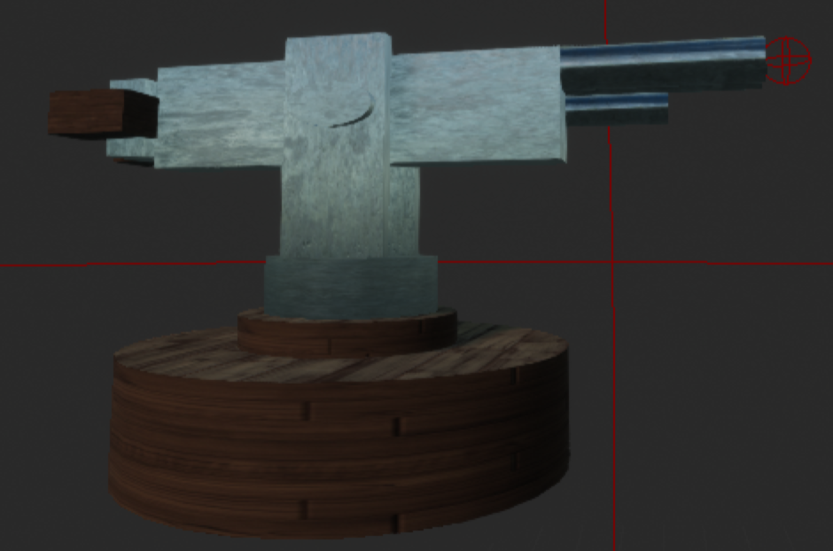
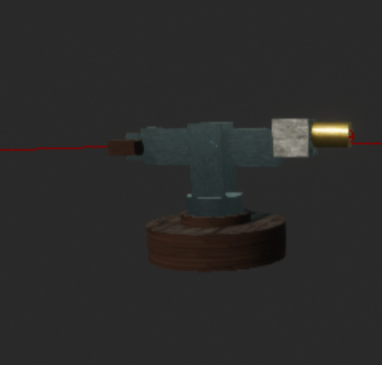
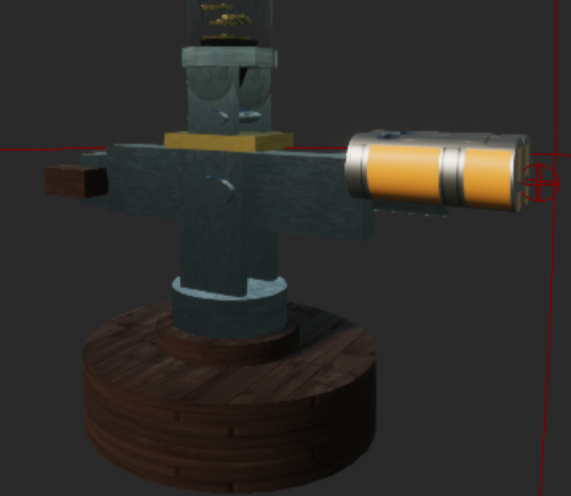

# Game Design technical specification

## Team

Author: [Alexis Lasselin](https://github.com/alexislasselin)
Other team members:

- [Laura-Lee Hollande](https://github.com/lauraleehollande);
- [Nicolas Mida](https://github.com/Nicolas-Mida);
- [Vivien Bistrel Tsangue](https://github.com/Bistrel2002);
- and [Robin Debry](https://github.com/robin-debry).

---

Table of Contents

- [Game Design technical specification](#game-design-technical-specification)
	- [Team](#team)
	- [1. Introduction](#1-introduction)
		- [A. Purpose of the document](#a-purpose-of-the-document)
		- [B. Purpose of the project](#b-purpose-of-the-project)
	- [2. Minimum System Requirements](#2-minimum-system-requirements)
	- [3. Graphics](#3-graphics)
	- [4. User Interface](#4-user-interface)
	- [5. Audio](#5-audio)
	- [6. Gameplay Features](#6-gameplay-features)
		- [A. Tower Types](#a-tower-types)
			- [Basic Tower - The Gunner](#basic-tower---the-gunner)
			- [Slow Tower - The Bitcoin Launcher](#slow-tower---the-bitcoin-launcher)
			- [Splash Tower - The Potato Gun](#splash-tower---the-potato-gun)
		- [B. Enemy Types](#b-enemy-types)
			- [Basic Enemy - The Thief](#basic-enemy---the-thief)
			- [Fast Enemy - The Slayer](#fast-enemy---the-slayer)
			- [Tank Enemy - The Warrior](#tank-enemy---the-warrior)
			- [Note](#note)
		- [C. First Person View](#c-first-person-view)
		- [D. Stages Types](#d-stages-types)
		- [E. Win/Lose Conditions](#e-winlose-conditions)
		- [F. Rewards](#f-rewards)
		- [G. Upgrades](#g-upgrades)
	- [7. Programming](#7-programming)
		- [A. Programming Languages](#a-programming-languages)
			- [Why did we choose Blueprints?](#why-did-we-choose-blueprints)
		- [B. Software](#b-software)
			- [Why did we choose Unreal Engine 4?](#why-did-we-choose-unreal-engine-4)
	- [8. Testing and Debugging](#8-testing-and-debugging)
	- [9. Deployment Distribution Services](#9-deployment-distribution-services)
	- [10. Glossary](#10-glossary)

---

## 1. Introduction

### A. Purpose of the document

<!--  Purpose of the document -->

This document is a technical specification of the game we are going to create. It is a document that will be used by the team to guide the development of the game. It will be used to define the game's universe, the game's mechanics and the game's assets.

### B. Purpose of the project

<!--  Purpose of the project -->

The purpose of this project is to create a fully working game using Unreal Engine 4. We are completely free to choose the theme of the game, the game mechanics and the game's universe.

Our group has chosen to create a Tower Defense game based on a bank universe

## 2. Minimum System Requirements

<!-- Specifications for the minimum and recommended system requirements for the game. -->

For the moment, we are not sure about the minimum and recommended system requirements for the game. We will update this section when we will have more information about the game's assets.

<!-- Here are the minimum and recommended system requirements for the game:

| **Name** | **Minimum** | **Recommended** |
|:--------:|:-----------:|:---------------:| -->

## 3. Graphics

<!-- Specifications for character models, environments, textures, lighting, special effects, and other graphical elements, such as resolution, level of detail, shaders, etc. -->

- **Character Models**: We will use character models for the game's enemies and the game's towers.
- **Interface**: We will use interface for the game's menus, the game's UI, the game's levels, the game's win/lose conditions, the game's rewards.
- **Particles**: We will use particles for the game's projectiles, the game's explosions, the game's upgrades.

## 4. User Interface

<!-- Specifications for menus, buttons, icons, dialogue windows, progress indicators, progress bars, sliders, etc. -->

- **Main Menu**: Start Game, Tutorial, Options, Quit
- **In-game UI**: Tower selection, Upgrade, Pause
- **Dialogue Window**: "Congratulations, You Won!", "You Lost", "You Won the Level", "You Lost the Level", "You Won the Game", "You Lost the Game" and some explanations about the game in the tutorial.

## 5. Audio

<!-- Specifications for sound effects, music, voiceovers, etc. This includes sound quality, file format, audio channels, etc. -->

- **Sound Effects**: We will use sound effects for the game's menus (when a button is clicked), the game's towers (when you build them), the game's enemies (when they reach the vault), the game's projectiles, the game's upgrades, the game's win/lose conditions, the game's rewards, etc.
- **Music**: We will use music for the game's menus, the game's UI, the game's levels, the game's win/lose conditions, the game's rewards, etc.
- **Voiceovers**: We will probably not use voiceovers in the game.

## 6. Gameplay Features

<!-- Specifications for gameplay elements such as tower types, enemy types, level types, attack types, defense mechanisms, win/loss conditions, rewards, upgrades, bonuses, etc. -->

### A. Tower Types

We will have 3 tower types: a basic tower, a slow tower and a splash tower (AOE).
All the statitics(*in italic*) of the towers given below are not final. They are just here to give you an idea of what we are thinking about.

#### Basic Tower - The Gunner

- **Description**: The basic tower is a tower that shoots dollars at the enemies. It is the most basic tower in the game.
- **Cost**: The basic tower costs 60 dollars.
- **Attack Type**: The basic tower shoots projectiles at the enemies. The projectiles are the most basic projectiles in the game, they deal damage to the enemies (*10 damage per projectile*) but the turret is the fastest turret in the game (*5 projectiles per second*).
- **Improvements costs**: The turret can be upgraded 2 times. The first upgrade costs *80* dollars and the second upgrade costs *130* dollars. We don't know exactly a good balance for the upgrades yet.

#### Slow Tower - The Bitcoin Launcher

- **Description**: The slow tower is a tower that shoots bitcoin at the enemies.
- **Cost**: The slow tower costs 180 dollars.
- **Attack Type**: The slow tower shoots projectiles at the enemies. The projectiles are the slowest projectiles in the game, they deal damage to the enemies (*15 damage per projectile*) and they slow the enemies (*20% slow for 2 seconds*). The turret get a medium speed (*1 projectile every 1.5 seconds*).
- **Improvements costs**: The turret can be upgraded 2 times. The first upgrade costs *200* dollars and the second upgrade costs *250* dollars. We don't know exactly a good balance for the upgrades yet.

#### Splash Tower - The Potato Gun

- **Description**: The splash tower is a tower that throws gold ingots at the enemies. The gold ingots explode when they hit an enemy.
- **Cost**: The splash tower costs 120 dollars.
- **Attack Type**: The splash tower is the one with the most damage in the game. The projectiles are the most powerful projectiles in the game, they deal damage to the enemies in a radius of 2X2 tiles (25 damage per projectile). To balance the tower, the turret is the slowest turret in the game (*1 projectile every 2 seconds*).
- **Improvements costs**: The turret can be upgraded 2 times. The first upgrade costs *160* dollars and the second upgrade costs *210* dollars. We don't know exactly a good balance for the upgrades yet.

### B. Enemy Types

We will have 3 enemy types: a basic enemy, a fast enemy and a tank enemy. All the statitics(*in italic*) of the enemies given below are not final. They are just here to give you an idea of what we are thinking about. The images are not the representation of the final enemies, just an inspiration from Team Fortress 2 and Assassin's Creed.

#### Basic Enemy - The Thief

- **Description**: The basic enemy is the most basic enemy in the game. There is nothing special about him.
- **Attack Type**: The thief has *300 health points* and he deals *1 damage* if he reaches the vault. He moves 1 tile per second.
- **Rewards**: The thief drops *10 dollars* when he dies.

#### Fast Enemy - The Slayer

- **Description**: The fast enemy is the fastest enemy in the game. He is very fast and he can be hard to kill.
- **Attack Type**: The slayer has *100 health points* and he deals *2 damage* if he reaches the vault. He is the fastest enemy in the game, he can move 2 tiles per second.
- **Rewards**: The slayer drops *5 dollars* when he dies.

#### Tank Enemy - The Warrior

- **Description**: The tank enemy is the tankiest enemy in the game. He is very hard to kill, but, he is also very slow to equilibrate the game.
- **Attack Type**: The warrior has *500 health points* and he deals *3 damage* if he reaches the vault. He is the slowest enemy in the game, he can move 0.5 tiles per second.
- **Rewards**: The warrior drops *20 dollars* when he dies.

#### Note

After each wave, the enemies will get stronger. Their HP will increase by 20%.

### C. First Person View

Inspired by FPS games, the game will have a first person view. The player will be able to move on the map to see the enemies and the towers. However, he will not be able to interact with the turrets, this is only a function of immersion in the game.

### D. Stages Types

Currently, we are thinking about having 2 stages: a tutorial level and the game in a bank universe.

### E. Win/Lose Conditions

The player will win if he manages to kill all the enemies for every wave. The player will lose an enemy reaches the vault.

### F. Rewards

The player will earn golds by killing enemies. The golds will be used to buy towers and upgrades turrets. You can also earn golds by selling towers(the player will get 50% of the initial cost of the tower).

### G. Upgrades

The player will be able to upgrade his towers. The upgrades will be: damage, range, attack speed, slow and AOE efficiency, etc.

## 7. Programming

<!-- Specifications for programming features such as scripts, modules, plugins, programming languages, libraries, etc. -->
### A. Programming Languages

- **Blueprints** is the main programming language used in the project.

#### Why did we choose Blueprints?

<!-- Why did we choose Blueprints? -->

We chose Blueprints because it is a very powerful programming language. It is very easy to use and it is very easy to learn. By using Unreal Engine 4 and Blueprints, we are able to create a working game in a very short time.

### B. Software

- **Unreal Engine 4** is the main game engine used in the project. (Version 4.27)

#### Why did we choose Unreal Engine 4?

<!-- Why did we choose Unreal Engine 4? -->

We chose Unreal Engine 4 because it is a very powerful game engine. It is very easy to use and it is very easy to learn. The blueprints system help us a lot to create a game. With this game engine, we are able to create a working game with the short delay we have.s

## 8. Testing and Debugging

<!-- Specifications for quality and performance testing, test scenarios, debugging tools, bug reports, etc. -->

The game will be tested by our QA. The QA will test the game and report bugs. The QA will also test the game's performance and report any performance issues.

## 9. Deployment Distribution Services

<!-- Specifications for deployment platforms such as Steam, Google Play, Apple Store, etc. -->

We will not deploy the game on any platform. The game will only be available on the GitHub repository. But, at the start of the project, we planned to deploy the game on Steam, but, we decided to not deploy the game on Steam because we don't have enough time and money to do it.

## 10. Glossary

| **Name** | **Abrevation** | **Definition** |
|:--------:|:--------------:|:--------------:|
| 2D isometric | 2D iso | [2D isometric](https://en.wikipedia.org/wiki/Isometric_graphics) is a 2D projection of a 3D scene onto a plane. |
| Area Of Effect | AOE | [Area of Effect](https://en.wikipedia.org/wiki/Glossary_of_video_game_terms#area_of_effect), commonly abbreviated as "AoE", refers to the range of an ability or attack that affects multiple targets within a specific area, rather than a single target. |
| Blueprints | BP | [Blueprints](https://docs.unrealengine.com/en-US/Engine/Blueprints/index.html) are visual scripting tools that allow you to create logic for your game without writing code. |
| Damage | DMG | [Damage](https://en.wikipedia.org/wiki/Damage_(video_gaming)) is a measure of how much health a character loses when they are attacked. |
| First Person Shooter | FPS | [First-person shooter](https://en.wikipedia.org/wiki/First-person_shooter) is a video game genre centered around gun and other weapon-based combat in a first-person perspective. |
| Health Points | HP | [Health Points](https://en.wikipedia.org/wiki/Health_point) are a measure of how much damage a character can take before being defeated. |
| Steam | Steam | [Steam](https://store.steampowered.com/) is a digital distribution platform developed by Valve Corporation, which offers digital rights management (DRM), multiplayer gaming, video streaming and social networking services. |
| Tower Defense | TD | [Tower Defense](https://en.wikipedia.org/wiki/Tower_defense) is a subgenre of strategy video games in which the player must defend a particular location or path against waves of enemies by strategically placing defensive structures, such as towers or traps, along the path to defeat the enemies before they reach their destination. |
| Unreal Engine | UE | [Unreal Engine](https://www.unrealengine.com/en-US/) is a 3D computer graphics game engine developed by Epic Games. |

*All the links in this document are clickable and redirect to the source of our glossary.*
