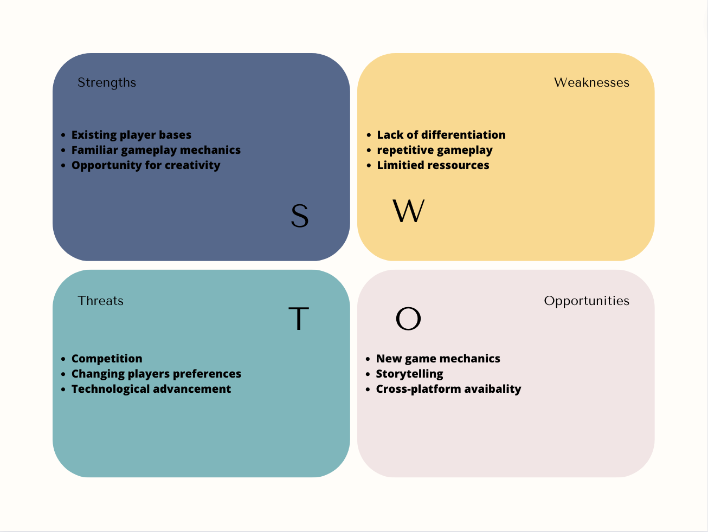

# Problem solving

## DMAIC method

How to make our game unique?

### Define our problem

Our game lacks unique features that set it apart from other similar games, which may negatively affect its appeal to potential players.

### Measure our problem

To define what can make our game unique we have been looking for some data on different platform to target the frustration points of the players in the tower defense game. We also asked some players to share with us what they would, what they like or dislike in this type of game.

- **Players feedback:** We have collected different feedbacks from players (written and oral opinions) that we have reported in the table below by separating the positive and negative points.

| Positive                  | Negative                               |
|---------------------------|----------------------------------------|
| Random and infinite waves | Can be repetitive and predictible      |
| Have an IDLE system       | No real story or context               |
| You can play offline      | Requires too much investment           |
| Infinite game             | All game of this type are very similar |
| Competition in game       | No real strategy                       |
| Free or freenium          | Pay to win                             |
| Prestige system           | Too easy                               |
| Share with your friends   | Too short                              |

Plus, we have been looking for what make a good game in the last few years according to the players and the trends in video game and in tower defense game.

- Customization/personalization in game
- Easy to use and understandable
- UX/UI design
- Continuous challenge
- Be rewarded as a player (achievements, ...)
- Regurlaly updated with new events or patch
- Online multiplayer
- Competition
- Compatibility
- Difficulty system
  
### Analyze our problem

Once our data collecting we create a SWOT matrice to organize them.

### Improve what we have

Based on our analysis we have planned to add the following features:

- IDLE game
- Skill tree
- Achievements
<!-- - "bestiaire" -->
- Our own Prestige system
- Compatibility between MAC and Windows
- UX/UI interface and tutorial
- Story telling

### The control

We explain our game with all the points said before and it was validated, we also exchange with some players of tower defense and they was interesting in our game and these new features.

We will still have to test its features once they are implemented in our game.

Glossary

| Word                                                    | Definition                                                                                                                                                        | Sources                                                                                                                                                                  |
|---------------------------------------------------------|-------------------------------------------------------------------------------------------------------------------------------------------------------------------|--------------------------------------------------------------------------------------------------------------------------------------------------------------------------|
| DMAIC (Define, Measure, Analyze, Improve, Control)      | In problem solving, the DMAIC method is a roadmap that can be used for any projects or quality improvements that need to be made.                                 | [DMAIC method](https://asq.org/quality-resources/dmaic#:~:text=What%20Does%20DMAIC%20Stand%20For,(internal%20and%20external)%20requirements.)                            |
| SWOT (Strength, Weakness, Opportunity, Threart) matrice | In problem solving, a SWOT is a matrice to identify the internal and external factors that are helpful and harmful to addressing the problems at hand             | [SWOT analysis](https://www.chiroeco.com/how-to-solve-your-biggest-problems-with-swot-analysis/)                                                                         |
| Freenium                                                | It is a type of business model that offers basic features of a product or service to users at no cost and charges a premium for supplemental or advanced features | [Freenium](https://www.investopedia.com/terms/f/freemium.asp#:~:text=our%20editorial%20policies-,What%20Is%20Freemium%3F,for%20supplemental%20or%20advanced%20features.) |
| Pay to win                                              | A game in where paying players have a clear advantage over non-paying players                                                                                     | [Pay to win](https://www.macmillandictionary.com/dictionary/british/pay-to-win)                                                                                          |

